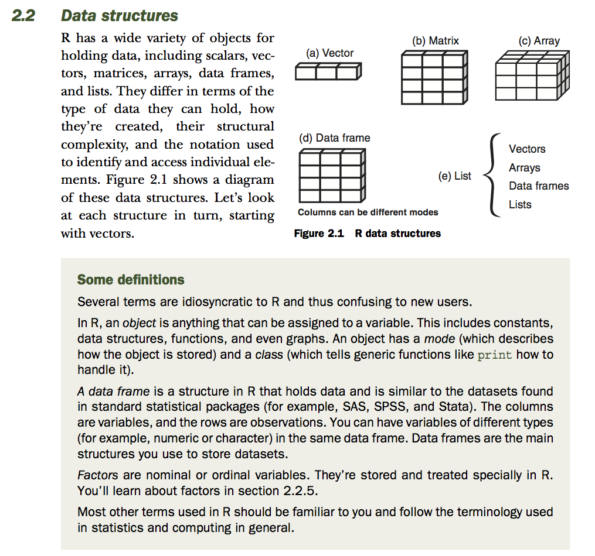

## Estrutura de dados (objetos) no R (Kobacoff, 2015)




  


* Vetores

https://stringr.tidyverse.org

```{r, eval=FALSE, warning=FALSE}

a <- c(1, 2, 5, 3, 6, -2, 4)
b <- c("one", "two", "three")
c <- c(TRUE, TRUE, TRUE, FALSE, TRUE, FALSE)

typeof(a)
typeof(b)
typeof(c)

d <- c(1L, 2L, 5L, 3L, 6L, -2L, 4L)
typeof(d)

a[1:3]

```
```{r}
c(a, b)
c(b, c)
c(b , as.integer(c))
c(a, c)

```

```{r}

class(a)
class(b)
class(c)

str(a)
str(b)
str(c)


```


```{r}

typeof(letters)
typeof(1:10)

v <- 1.3456

v <- round(v, digits = 1)

typeof(v)

typeof(as.integer(v))

length(a)


```

* Vetores nomeados
```{r}
library(tidyverse)
v <- c(x = 1, y = 2, z = 4)
names(v)

class(v)

attributes(v)
str(v)

v["z"]
glimpse(v)

v[ "z" ]

class(names(v))

v <- set_names(1:5, c("A", "B", "C", "D", "E"))

resp <- c("A", "B", "A","C", "A", "D","A", "E", "A", "E", "A")

v["C"]
v[resp]


```

* Subsetting
```{r}

x <- c("one", "two", "three", "four", "five")

names(x) <- c("A", "B", "C", "D", "E")

x["B"]
x[5]


x[c(3, 2, 5)]

x[c(1, 1, 5, 5, 5, 2)]


x <- c(10, 3, NA, 5, 8, 1, NA)

x[ !is.na(x) ]

`[`

```

* Matrizes

```{r, eval=FALSE, warning=FALSE}

y <- matrix(1:20, nrow=5, ncol=4)
y <- 1:20
dim(y) <- c(2,5, 2)
class(y)
y

y[2,, ]

class(y)
typeof(y)
str(y) 
glimpse(y)
attributes(y)


a <- c(1,26,24,68)

rnames <- c("R1", "R2")
cnames <- c("C1", "C2") 
matriz <- matrix(
        a, nrow=2, ncol=2, byrow=TRUE,
        dimnames=list(rnames, cnames)
        )

matriz
attributes(matriz)

matriz["R1", "C2"]

class(matriz)
typeof(matriz)
str(matriz)


 dim1 <- c("A1", "A2")
 dim2 <- c("B1", "B2", "B3")
 dim3 <- c("C1", "C2", "C3", "C4")
 z <- array(1:24, c(2, 3, 4), dimnames=list(dim1, dim2, dim3))
 
 z
class(z)
matriz
matriz["R1" , "C2"]

matriz[1,2] <- "1"


```


* Data frames
```{r, eval=FALSE, warning=FALSE}

patientID <- c(1, 2, 3, 4)
age <- c(25, 34, 28, 52)
diabetes <- c("Type1", "Type2", "Type1", "Type1")
status <- c("Poor", "Improved", "Excellent", "Poor")


patientdata <- data.frame(patientID, age, diabetes, status)
patientdata <- tibble(patientID, age, diabetes, status)
patientdata

class(patientdata)
typeof(patientdata)
str(patientdata)
glimpse(patientdata)

typeof(patientdata[1 ,  ])
typeof(patientdata[ ,  1])
str(patientdata[1 ,  ])

patientdata[[1]]
patientdata[3]

patientdata$diabetes


patientdata[, 1] <- (c(, 2, 3, 4))
patientdata [1,1] <- list (1:4)
patientdata[1,1] <- c(1:4)

patientdata$sintomas <- I(list(c(1, 4), c(1, 2, 3, 4), c(1), c(2,4)))
class(patientdata)
typeof(patientdata)


```

* Factors

https://forcats.tidyverse.org/articles/forcats.html

```{r, eval=FALSE, warning=FALSE}


status <- c("ruim", "bom", "arrazou", "ruim", "muito bom", "arrazou")
class(status)
typeof(status)


status <- factor(status, levels=c("ruim", "bom", "muito bom", "excelente", "arrazou"))

typeof(status)
as.numeric(status)
as.character(status)
levels(status)


class()


sex <- c("M", "F", "F", "F", "F", "M", "X")

sex <- c(1, 2, 1, 1, 2, 2, 1, 1)

sex <- factor(sex)

levels(sex)

levels(sex)

forcats::fct_c(sex, status)


str(patientdata)

str()
str(patientdata[2])
str(patientdata[[2]])

patientdata[4][[1]]

patientdata[[4]]


```

* Lists
```{r, eval=FALSE, warning=FALSE}

g <- "My First List"
h <- c(25, 26, 18, 39)
j <- matrix(1:10, nrow=5)
k <- c("one", "two", "three")

mylist <- list(title=g, ages=h, j, k)
class(mylist)

mylist
names(mylist)

mylist$title
mylist$ages

mylist[[1]]

str(mylist)

class(mylist[1])
mylist$title

class(mylist[[1]])

mylist[[3]]
mylist[[4]]

mylist[4]

str(mylist[3])

mylist[[3]][ , 2]

x <- NULL

```

```{r}

x1 <- list(c(1, 2), c(3, 4))
x2 <- list(list(1, 2), list(3, 4))
x3 <- list(a = 1, b = list( c= 2, d = list(e = 3)))

x3$b$d$e
        
        
x1[[1]]

str(x2)
str(x2[[1]])

x2[[1]][[1]]

x2[[2]][[2]]

x2[[1]]


```
  

  

## Exercício: aprendendo estrutura de dados
* str, class, typeof
* Crie um vetor
* Crie uma matriz
* Crie um dataframe
* Crie uma lista
