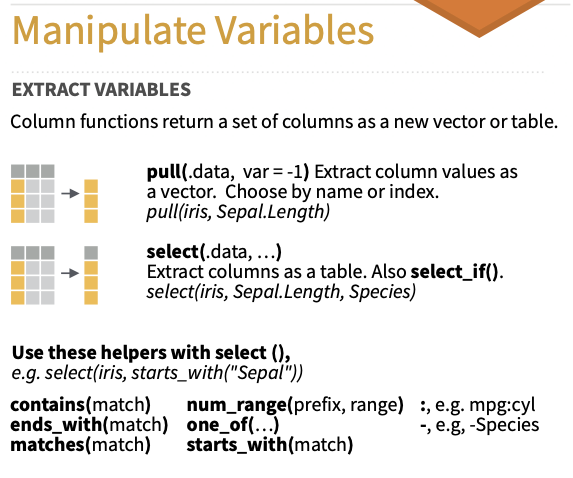
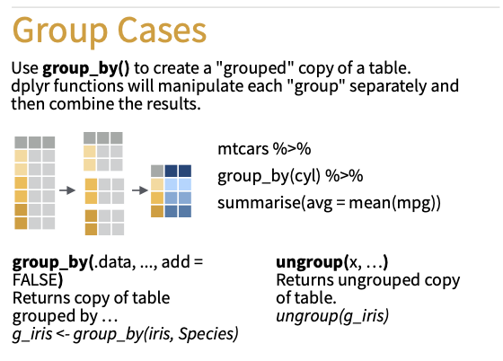

### Bibliotecas

```{r}

library(tidyverse)

```

### Lê dados

```{r}
load("../dados/enem.Rdata")
```


```{r}

```

### Transformação de dados com o `dplyr`
  

  


* filter() - filtra linhas
* select() - seleciona colunas
* arrange() - ordena a base
* mutate() - cria/modifica colunas
* group_by() - agrupa a base
* summarise() - sumariza a base


### Exemplos: `filter`  

{width=300px}  

```{r}

  filter(enem, TP_SEXO == "Feminino" )

  glimpse(enem$TP_SEXO)
  
   filter(enem, NU_NOTA_MT > 700)
   filter(enem, NU_NOTA_MT > 700 & TP_SEXO == "Feminino")
   filter(enem, (TP_SEXO == "Feminino" | NU_NOTA_CH > 700 ))
  
   df_alto <- enem %>% filter(NU_NOTA_MT > 700)
   
   enem2 <- enem

   c(0,0, 0, 1) %in% c(1, 2, 3)
   
   enem$SG_UF_NASCIMENTO %in% c("RS", "SP")
   
  filter(enem, SG_UF_NASCIMENTO %in% c("RS", "SP"))
  filter(enem, str_detect(TP_ST_CONCLUSAO, "cursando"))

  library(sjmisc)
  frq(enem$TP_ENSINO)
  
  enem %>%  
    ggplot() + geom_bar(
    aes(y = NU_NOTA_MT, x = TP_ENSINO, fill = TP_ENSINO), 
        stat = "summary", 
        fun = "mean", 
      show.legend = FALSE
     ) + 
    coord_flip()

  enem %>% 
    filter(!is.na(TP_ENSINO) ) %>%
    ggplot() + geom_bar(
    aes(y = NU_NOTA_MT, x = TP_ENSINO, fill = TP_ENSINO), 
        stat = "summary", 
        fun = "mean", 
      show.legend = FALSE
     ) + 
    coord_flip()

  !is.na(enem$TP_ENSINO)
  
```

Grolemund & Wickham (2017, <https://r4ds.had.co.nz/transform.html>, 5.2):

"The order of operations doesn’t work like English. You can’t write filter(flights, month == (11 | 12)), which you might literally translate into “finds all flights that departed in November or December”. Instead it finds all months that equal 11 | 12, an expression that evaluates to TRUE. In a numeric context (like here), TRUE becomes one, so this finds all flights in January, not November or December. This is quite confusing! A useful short-hand for this problem is x %in% y"

```{r}

filter(flights, (month == 11  | month == 12))

x <- (1:10)
y <- (1:4)
x %in% y

y %in% x

month %in% c(11, 12)

```


  

  

  


### Operações com variáveis cujos valores contenham "not available" `NA`
Grolemund & Wickham (2017):
"filter() only includes rows where the condition is TRUE; it excludes both FALSE and NA values" () 

```{r}
  
  # Let x be Mary's age. We don't know how old she is.
  x <- NA
  
  # Let y be John's age. We don't know how old he is.
  y <- NA
  
  # Are John and Mary the same age?
  x == y
  #> [1] NA
  # We don't know!
  
  na.rm = TRUE
  
  is.na(NA)

```


### Exemplos: `select`

{width=400px}  


* https://dplyr.tidyverse.org/reference/select.html
* https://github.com/tidymodels/corrr
* https://cran.r-project.org/web/packages/corrplot/vignettes/corrplot-intro.html


```{r}
  
  select(enem, NU_NOTA_CN, NU_NOTA_MT)
  select(enem, NU_NOTA_CN:NU_NOTA_REDACAO)
  
  df <- enem %>% select( NU_NOTA_CN:NU_NOTA_MT)
  
  select(df, -NU_NOTA_CN)
  
  select(df, -c(NU_NOTA_CN, NU_NOTA_LC))
  
  # helper functions
  select(enem, contains("NU_NOTA"))
  
  names(enem)
  v <- names(enem)
  
  v[ c(1, 2, 45:58) ]
  v <- v[ c(1, 2, 45:58) ]
  
  select(enem, all_of(v))
  
 
```

### Exemplos: `arrange`

{width=400px}  

```{r}
  arrange(mtcars, mpg)


  arrange(enem, NU_NOTA_MT)
  
  enem %>% 
    select(NU_NOTA_CN:NU_NOTA_MT) %>%
    arrange( desc(NU_NOTA_MT))
  
  names(enem)
  
  enem %>% 
    arrange(desc(mt_scores)) %>%
    select(TP_SEXO, NU_NOTA_MT, mt_scores, everything()) %>%
    view
  
  enem %>% 
    arrange(desc(NU_NOTA_LC)) %>%
    select(TP_SEXO, NU_NOTA_LC, mt_scores, everything()) %>%
    view

  
  
```

### Exemplos: `mutate`

{width=400px}  


```{r}

  enem %>% 
    select(NU_NOTA_CN:NU_NOTA_MT) %>%
    mutate(nota_geral = (NU_NOTA_CN + NU_NOTA_CH + NU_NOTA_LC + NU_NOTA_MT) / 4)
  
  is.na(enem$NU_NOTA_CN) %>% sjmisc::frq()
 
  enem %>% 
    select(NU_NOTA_CN:NU_NOTA_MT) %>%
    mutate(
      mean_cn = mean(NU_NOTA_CN, na.rm = TRUE),
      mean_mt = mean(NU_NOTA_MT, na.rm = TRUE)
    )
  
  # erro !!!
  enem %>% 
    select(NU_NOTA_CN:NU_NOTA_MT) %>%
    mutate(
      mean = mean(NU_NOTA_CN, NU_NOTA_MT, na.rm = TRUE)
    )
  
  attributes(scale(enem$NU_NOTA_CH))
  typeof(scale(enem$NU_NOTA_CH))
  class(scale(enem$NU_NOTA_CH))
  
  
  enem %>% 
    select(NU_NOTA_CN:NU_NOTA_MT) %>%
    mutate(
      zCN = scale(NU_NOTA_CN),
      zCH = scale(NU_NOTA_CH),
      zLC = scale(NU_NOTA_LC),
      zMT = scale(NU_NOTA_MT),
      z_geral = (zCN + zCH+ zLC + zMT)/4,
      rank = min_rank(z_geral),
      percentil_g =  percent_rank(z_geral)
      ) %>%
    arrange(rank)

```
### Exemplos: `group_by`

slides 

{width=400px}  
```{r}

  group_by(enem, SG_UF_RESIDENCIA) 

  df <- enem %>% group_by(SG_UF_RESIDENCIA) 
  
  glimpse(df)
  l <- attributes(df)
  
  l$groups %>% view
  
  enem %>% group_by(SG_UF_RESIDENCIA) %>% tally()
  
  df <- enem 
  df %>% tally
  
  df <- enem %>% group_by(SG_UF_RESIDENCIA) 
  df %>% tally
  
  group_keys(df)
  
  group_indices(df) %>% sjmisc::frq()
  enem %>% group_by(SG_UF_RESIDENCIA) %>% tally()
  
  group_vars(df)

  df %>% ungroup() %>% tally

```
### Exemplos `summarise`

{width=400px}  

```{r}
  
  enem %>% 
    group_by(TP_DEPENDENCIA_ADM_ESC) %>%
    summarise(
      m_mt = mean(NU_NOTA_MT, na.rm=TRUE)
    )

  enem %>% 
    group_by(TP_DEPENDENCIA_ADM_ESC) %>%
    summarise(
      m_mt = mean(NU_NOTA_MT, na.rm=TRUE),
      N = n()
    )
  
   enem %>% 
    group_by(TP_DEPENDENCIA_ADM_ESC) %>%
    summarise(
      m_mt = mean(NU_NOTA_MT, na.rm=TRUE),
      N = n()
    )
   
  enem %>% 
    group_by(TP_DEPENDENCIA_ADM_ESC) %>%
    summarise(
      across(NU_NOTA_CN:NU_NOTA_MT, mean, na.rm=TRUE)
     )
  
  enem %>% 
    group_by(TP_DEPENDENCIA_ADM_ESC) %>%
    summarise(
      across(contains("NU_NOTA"), mean, na.rm=TRUE)
     )  
  
  enem %>% 
    group_by(TP_DEPENDENCIA_ADM_ESC) %>%
    summarise(
      across(contains("NU_NOTA"), ~mean(.x, na.rm=TRUE))
     )  
  
    l = list(M="mean", SD="sd", min="min", max="max")
  enem %>% 
    group_by(TP_DEPENDENCIA_ADM_ESC) %>%
    summarise(
      across(contains("NU_NOTA"), l , na.rm = TRUE)
        ) %>% view
  
  
  enem %>% 
    group_by(TP_DEPENDENCIA_ADM_ESC) %>%
    summarise(
      across(contains("NU_NOTA"), 
        list(
          mean = ~mean(.x, na.rm = TRUE),
          sd = ~sd(.x, na.rm=TRUE),
          min = ~min(.x, na.rm = TRUE), 
          max = ~max(.x, na.rm = TRUE)
        )  
      )
    ) %>% view
  
  
```

### Tarefas comuns de manipulação de dados

* Selecionar uma coluna como vetor de um `dataframe`  
```{r}

enem %>% select(NU_NOTA_MT)

enem %>% pull(NU_NOTA_MT)

enem %>% select(NU_NOTA_MT) %>% pull

enem$NU_NOTA_MT

enem %>% .$NU_NOTA_MT


```

* Calcular matriz de correlação  
```{r}

 library(psych)

  enem %>% 
    select( contains("NU_NOTA")) %>%
    corr.test() %>% 
    pluck("n")
  
  
    as.data.frame()
  
    `[[`("r")
   
    

  library(corrr)
   
  enem %>% 
    select( contains("NU_NOTA")) %>%
    correlate %>%
    shave %>%
    fashion %>% 
    view
  
  enem %>% 
     select( contains("NU_NOTA")) %>%
    correlate %>%
    network_plot(min_cor = .3)
   
  library(corrplot)
   
  enem %>% 
      select( contains("NU_NOTA")) %>%
      cor(use = "pairwise")

  enem %>% 
     select( contains("NU_NOTA")) %>%
     cor(use = "pairwise") %>%
     corrplot(method = "square")

 
  
```

* Criar tabelas normativas
```{r}

  enem %>% 
    mutate(perc_mt =  percent_rank(mt_scores)) %>%
    select(perc_mt, mt_scores) %>%
    arrange(perc_mt) %>%
    group_by(mt_scores) %>%
    summarise(perc_mt = round(first(perc_mt), 2))

  f <- ecdf(enem$mt_scores)
  plot(f)
  
  enem %>% 
    mutate(perc_mt =  f(mt_scores)) %>%
    select(mt_scores, perc_mt)
   
  normas <- tibble(
    score_mt = 0:45,
    percentil = f(score_mt)
   )
  
  f(45)

  library(scales)
  
  enem %>% 
    mutate(
      perc_MT =  percent_rank(NU_NOTA_MT),
      perc_CH = percent_rank(NU_NOTA_CH),
      perc_CN =  percent_rank(NU_NOTA_CN),
      perc_LC = percent_rank(NU_NOTA_LC)
      ) %>%
    ggplot() +
    geom_line(aes(y = perc_MT, x = NU_NOTA_MT), alpha = 1/2, color = "red") +
    geom_line(aes(y = perc_CH, x = NU_NOTA_CH), alpha = 1/2, color = "orange") +
    geom_line(aes(y = perc_CN, x = NU_NOTA_CN), alpha = 1/2, color = "blue") +
    geom_line(aes(y = perc_LC, x = NU_NOTA_LC), alpha = 1/2, color = "yellow") +
    scale_y_continuous(breaks = breaks_extended(10), labels = label_percent()) +
    scale_x_continuous(breaks = breaks_extended(20)) 
  
    

```

* Exercício 
  Como fazer o grafico cima com uma curva por prova ?
  
* Transformar escores para escalas padronizadas (POMP, z)  

https://scales.r-lib.org

```{r}

  enem %>% 
   select(NU_NOTA_CN:NU_NOTA_MT) %>%
    mutate( across( .funs = scale))

  library(scales)
  ?scales::rescale
  
  enem %>% 
   select(NU_NOTA_CN:NU_NOTA_MT) %>%
    mutate( across(everything(), scales::rescale, to=c(0, 100)) ) %>%
    summarise(across(everything(), l, na.rm=TRUE))

  # Ninja way

  rescale01 <- function(x) {
    range <- range(x, na.rm = TRUE)
    (x - range[1]) / (range[2] - range[1])
  }
  
  range(enem$NU_NOTA_CH)
  range <- 1

  range

 enem %>% 
   select(NU_NOTA_CN:NU_NOTA_MT) %>%
    mutate( across(everything(), rescale01))

```

* Saber quantas respostas cada pessoa deixou sem responder ("missing")
-  usando row-wise https://dplyr.tidyverse.org/articles/rowwise.html

```{r}
enem %>%
  rowwise %>%
  mutate(across(Q001:Q050, as.integer)) %>%
  mutate(resp_quest = c_across(Q001:Q050, ~sum(!is.na(.x)))) %>%
  relocate(resp_quest) %>% view


enem %>%
  rowwise %>%
  mutate(across(Q001:Q050, as.integer)) %>%
  mutate(resp_quest = sum(!is.na(c_across(Q001:Q050)))) %>%
  relocate(resp_quest) %>%
  view

```

* Calcular escores com soma/média de itens
```{r}
enem %>%
  rowwise %>%
  mutate(enem_total = mean(c_across(NU_NOTA_CN:NU_NOTA_MT))) %>%
  relocate(enem_total, NU_NOTA_CN:NU_NOTA_MT) %>% 
  glimpse()


df <- enem %>%
  rowwise %>%
  mutate(enem_total = mean(c_across(NU_NOTA_CN:NU_NOTA_MT))) %>%
  relocate(enem_total, NU_NOTA_CN:NU_NOTA_MT)

l <- attributes(df)

l$groups %>% view
 
```


* Análise multinível: centrar por grupo e adicionar média dos grupos  

```{r}
  
  enem %>% 
   select(NU_NOTA_CN:NU_NOTA_MT, SG_UF_RESIDENCIA) %>%
    group_by(SG_UF_RESIDENCIA) %>%
    mutate( 
      across(
        everything(),
        list(
          media = ~mean(.x, na.rm = TRUE),
          wg = ~scale(.x)
        )
      )
    ) %>% arrange(SG_UF_RESIDENCIA)


```