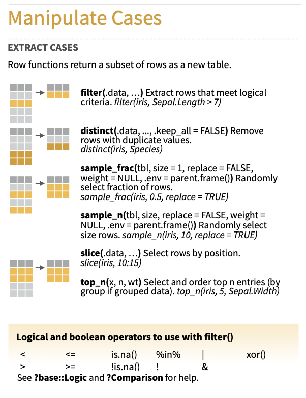
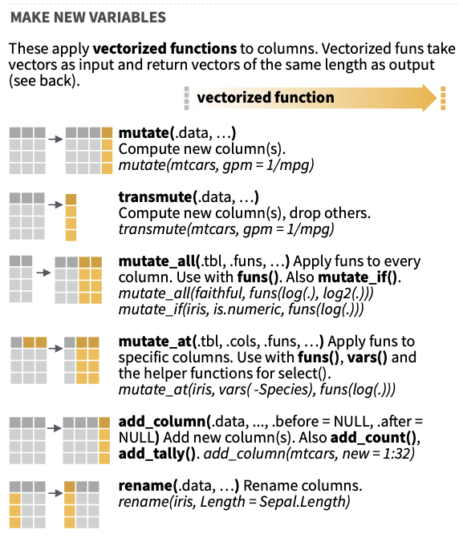
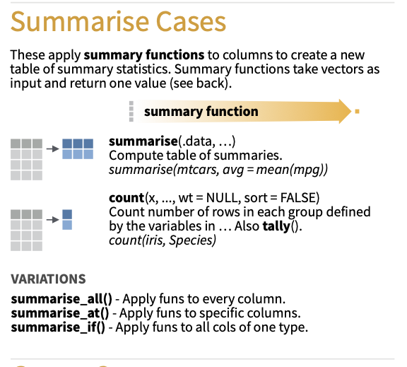

### Bibliotecas

```{r}
library(tidyverse)
```

### Lê dados

```{r}
load("../dados/enem.Rdata")
```

### Importa dados do excel ou spss

```{r}

library(readxl)
getwd()
bd_senna <- read_excel("/Users/rprimi/Dropbox (Personal)/Ciencia de dados/ds_psicom/dados/bd_senna_rdz_sal.xlsx", sheet = "bd_exp")

save.image(file="data.RData")

```

```{r}

```

### Transformaçào de dados com o `dplyr`
  

  


* filter() - filtra linhas
* select() - seleciona colunas
* arrange() - ordena a base
* mutate() - cria/modifica colunas
* group_by() - agrupa a base
* summarise() - sumariza a base


### Exemplos: `filter`  

{width=300px}  

```{r}

filter(enem, TP_SEXO == "Feminino")

filter(enem, NU_NOTA_MT > 700 & TP_SEXO == "Feminino")

filter(enem, NU_NOTA_MT > 700, TP_SEXO == "Feminino")


enem %>% filter(NU_NOTA_MT > 700, TP_SEXO == "Feminino")  

filter(enem, SG_UF_NASCIMENTO %in% c("RS", "SP"))

frq(enem$TP_ST_CONCLUSAO)

filter(enem, str_detect(TP_ST_CONCLUSAO, "cursando"))

 enem %>%  
    ggplot() + geom_bar(
    aes(y = NU_NOTA_MT, x = TP_ENSINO, fill = TP_ENSINO), 
        stat = "summary", 
        fun.y = "mean", 
      show.legend = FALSE
     ) + 
    coord_flip()

 
  enem %>% 
    filter(!is.na(TP_ENSINO) ) %>%
    ggplot() + geom_bar(
    aes(y = NU_NOTA_MT, x = TP_ENSINO, fill = TP_ENSINO), 
        stat = "summary", 
        fun.y = "mean", 
      show.legend = FALSE
     ) + 
    coord_flip()


```

Grolemund & Wickham (2017, <https://r4ds.had.co.nz/transform.html>, 5.2):

"The order of operations doesn’t work like English. You can’t write filter(flights, month == (11 | 12)), which you might literally translate into “finds all flights that departed in November or December”. Instead it finds all months that equal 11 | 12, an expression that evaluates to TRUE. In a numeric context (like here), TRUE becomes one, so this finds all flights in January, not November or December. This is quite confusing! A useful short-hand for this problem is x %in% y"

```{r}
data(flights)

filter(flights, month == 11 | month == 12)
filter(flights, month %in% c(11, 12))

filter(flights, month == (11 | 12)) 
 
 (11 | 12)
```


  

  

  


### Operações com variáveis cujos valores contenham "not available" `NA`
Grolemund & Wickham (2017):
"filter() only includes rows where the condition is TRUE; it excludes both FALSE and NA values" () 

```{r}
  
  # Let x be Mary's age. We don't know how old she is.
  x <- 30
  
  # Let y be John's age. We don't know how old he is.
  y <- NA
  
  # Are John and Mary the same age?
  x == y
 
   v <- c(10, 12, 20, 12)
   
   mean(v)
 
   v <- c(10, 12, 20, NA)
   
   mean(v, na.rm = TRUE)
   
   
     #> [1] NA
  # We don't know!
  
  
  
  is.na(NA)

```


### Exemplos: `select`

{width=400px}  


* https://dplyr.tidyverse.org/reference/select.html
* https://github.com/tidymodels/corrr
* https://cran.r-project.org/web/packages/corrplot/vignettes/corrplot-intro.html


```{r}
 
 
```

### Exemplos: `arrange`

{width=400px}  

```{r}
 

```

### Exemplos: `mutate`

{width=400px}  


```{r}

 

```
### Exemplos: `group_by`

slides 

{width=400px}  
```{r}


```
### Exemplos `summarise`

{width=400px}  

```{r}
  
 
```

### Tarefas comuns de manipulação de dados

* Selecionar uma coluna como vetor de um `dataframe`  
```{r}


```

* Calcular matriz de correlação  
```{r}

 
  
```
* Criar tabelas normativas
```{r}

 
    # Como fazer esse grafico com uma curva por prova ?

```

* Transformar escores para escalas padronizadas (POMP, z)  

https://scales.r-lib.org

```{r}

 

```

* Saber quantas respostas cada pessoa deixou sem responder ("missing")
-  usando row-wise https://dplyr.tidyverse.org/articles/rowwise.html

```{r}


```

* Calcular escores com soma/média de itens
```{r}


```


* Análise multinível: centrar por grupo e adicionar média dos grupos  

```{r}
  
 
  

```