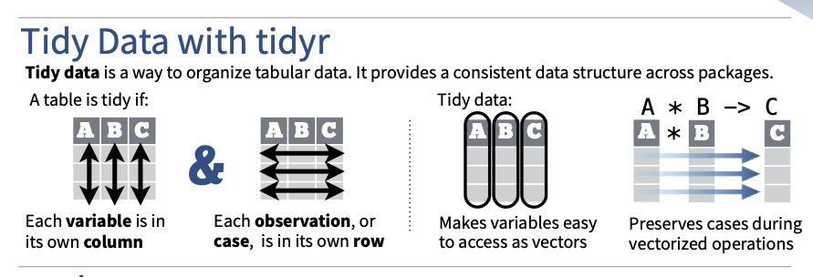

### Bibliotecas

```{r}
library(tidyverse)
```

### Arrumando dados

 http://www.jstatsoft.org/v59/i10/paper  
 
 https://r4ds.had.co.nz/tidy-data.html  
 
 https://www.curso-r.com/blog/2020-08-13-pivotagem/  
 
 slides de Amelia McNamara and Hadley Wickham no rstudio::conf2020
 https://github.com/rstudio-conf-2020/data-science-tidy  
 
   
 
 
### As funções de reshape (pivotagem)

* Formato `long`  
```{r}

library(tidyverse)

# Toy data
cases <- tribble(
  ~Country, ~"2011", ~"2012", ~"2013",
      "FR",    7000,    6900,    7000,
      "DE",    5800,    6000,    6200,
      "US",   15000,   14000,   13000
)

cases_long <- pivot_longer(cases, cols = c("2011", "2012", "2013"), names_to = "ano", values_to = "pop")

cases_long <- pivot_longer(cases, cols = `2011`:`2013`, names_to = "ano", values_to = "pop")

cases_long <- pivot_longer(cases, cols = starts_with("20"), names_to = "ano", values_to = "pop")

```

* Formato `wider`

E se quisessemos voltar os dados ao formato original?
```{r}

pivot_wider(cases_long, names_from = ano, values_from = pop)

```
* _Helper functions_ `separate` e `unite`

Queremos fazer uma tabela: city X size

```{r}

pollution <- tribble(
       ~city, ~amount,
  "New York_large",      23,
  "New York_small",      14,
    "London_large",      22,
    "London_small",      16,
   "Beijing_large",     121,
   "Beijing_small",     56
)

pollution %>% separate(city, sep = "_", into = c("city", "size"))

pollution %>% 
  separate(city, sep = "_", into = c("city", "size")) %>%
  pivot_wider(names_from = size, values_from = amount)


```
E se quiséssemos fazer o contrário
```{r}

pollution2 <- pollution %>% separate(city, sep = "_", into = c("city", "size"))

pollution2 %>% unite(col = "city", city, size, sep = "_" )


```
### Juntando bases: o `_join` do `dplyr`  

https://www.curso-r.com/material/manipulacao/  

https://r4ds.had.co.nz/relational-data.html#understanding-joins  

   

```{r}

x <- tribble(
  ~key, ~val_x,
     1, "x1",
     2, "x2",
     3, "x3"
)
y <- tribble(
  ~key, ~val_y,
     1, "y1",
     2, "y2",
     4, "y3"
)

left_join(x, y, by = "key")
right_join(x, y, by = "key")
full_join(x, y, by = "key")


```

* E se as variáveis `key` tivessem nomes diferentes

```{r}

x <- tribble(
  ~id, ~val_x,
     1, "x1",
     2, "x2",
     3, "x3"
)
y <- tribble(
  ~key, ~val_y,
     1, "y1",
     2, "y2",
     4, "y3"
)

left_join(x, y, by = c("id"="key"))


```
* E se tivéssemos identificadores duplicadas ?

```{r}

x <- tribble(
  ~key, ~val_x,
     1, "x1",
     2, "x2",
     2, "x3",
     1, "x4"
)
y <- tribble(
  ~key, ~val_y,
     1, "y1",
     2, "y2"
)

left_join(x, y, by = "key")

```

```{r}

x <- tribble(
  ~key, ~val_x,
     1, "x1",
     2, "x2",
     3, "x4"
)
y <- tribble(
  ~key, ~val_y,
     1, "y1",
     2, "x3",
     2, "y2"
)

left_join(x, y, by = "key")

```


```{r}

x <- tribble(
  ~key, ~val_x,
     1, "x1",
     2, "x2",
     2, "x3",
     3, "x4"
)
y <- tribble(
  ~key, ~val_y,
     1, "y1",
     2, "y2",
     2, "y3",
     3, "y4"
)
left_join(x, y, by = "key")


```
  
### Na prática

* Se quiséssemos comparar a distribuição dos esccores nas 4 provas do ENEM em um gráfico comum ?

https://www.researchgate.net/publication/263860877_Rasch-Master%27s_Partial_Credit_Model_in_the_Assessment_of_Children%27s_Creativity_in_Drawings

* Vamos fazer a distribuição das notas por sexo  (note que podemos ver como o parâmetro de "polimento" `adjust` funciona)
```{r}

load("../dados/enem.Rdata")


enem %>% ggplot(aes(x = NU_NOTA_MT, fill = TP_SEXO)) +
          geom_density( alpha = .50)

enem %>% ggplot(aes(x = NU_NOTA_MT, fill = TP_SEXO)) +
          geom_density(alpha = .50, adjust = 1)

enem %>% ggplot(aes(x = NU_NOTA_LC, fill = TP_SEXO)) +
          geom_density(alpha = .50)

enem %>% ggplot(aes(x = NU_NOTA_MT, fill = TP_SEXO)) +
          geom_density(alpha = .50, position = "fill")


```


```{r}

library(scales)

enem %>% 
  select(NU_INSCRICAO, TP_SEXO, NU_NOTA_CN:NU_NOTA_MT) %>%
  pivot_longer(
    cols = NU_NOTA_CN:NU_NOTA_MT, 
    names_to = "enem",
    values_to = "escr_tri"
    ) %>%
   ggplot(aes(x = escr_tri, fill = enem)) +
    geom_density(alpha = .50) +
    scale_fill_grey() +
    scale_x_continuous(breaks = scales::breaks_width(100)) +
    facet_wrap(~TP_SEXO, ncol = 1)
  

```
```{r}

names(enem)

 enem %>%  pivot_longer(
    cols = NU_NOTA_CN:NU_NOTA_MT, 
    names_to = "prova",
    values_to = "nota_TRI"
    ) %>% 
    select(NU_INSCRICAO, prova, nota_TRI) %>%
    group_by(prova) %>%
    dplyr::mutate(percentil=percent_rank(nota_TRI)) %>% 
    
    ggplot(aes(y = percentil, x = nota_TRI, color = prova), alpha = 1/2) +
    geom_line()  +
    scale_y_continuous(breaks = breaks_extended(10), labels = label_percent()) +
    scale_x_continuous(breaks = breaks_extended(20)) 


    
```

