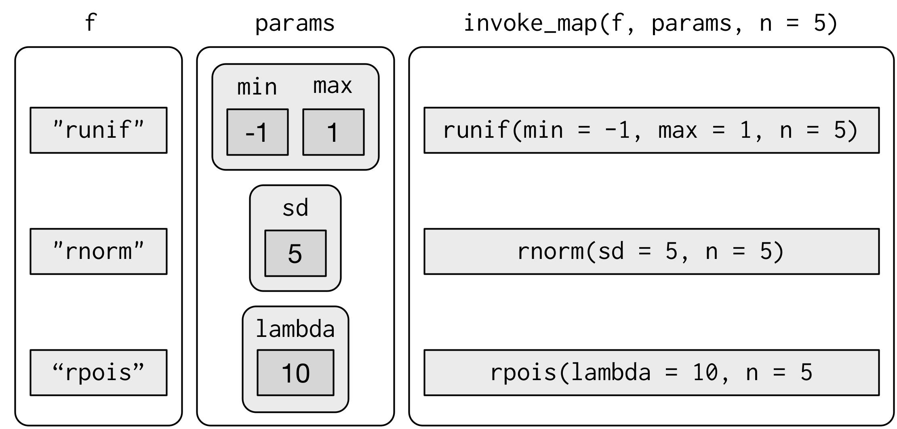

### Bibliotecas
```{r}
library(tidyverse)
```

### Funções

```{r}

 f <- function() { 
   cat("Alô Mundo!") 
   }
 
  f()

```


* Automação
* Empacotar atividades repetitivas complexas

Wickham & Grolmund (2017, cap 19 )

```{r}
  
  df <- tibble::tibble(
    a = rnorm(10),
    b = rnorm(10),
    c = rnorm(10),
    d = rnorm(10)
  )
  
  df$a <- (df$a - min(df$a, na.rm = TRUE)) / 
    (max(df$a, na.rm = TRUE) - min(df$a, na.rm = TRUE))
  
  df$b <- (df$b - min(df$b, na.rm = TRUE)) / 
    (max(df$b, na.rm = TRUE) - min(df$a, na.rm = TRUE))
  
  df$c <- (df$c - min(df$c, na.rm = TRUE)) / 
    (max(df$c, na.rm = TRUE) - min(df$c, na.rm = TRUE))
  
  df$d <- (df$d - min(df$d, na.rm = TRUE)) / 
    (max(df$d, na.rm = TRUE) - min(df$d, na.rm = TRUE))
  
  x <- df$a
  (x - min(x, na.rm = TRUE)) / (max(x, na.rm = TRUE) - min(x, na.rm = TRUE))
  
  rng <- range(x, na.rm = TRUE)
  (x - rng[1]) / (rng[2] - rng[1])
  
  rescale01 <- function(x) {
    rng <- range(x, na.rm = TRUE)
    (x - rng[1]) / (rng[2] - rng[1])
  }
  
  df$a <- rescale01(df$a)
  df$b <- rescale01(df$b)
  df$c <- rescale01(df$c)
  df$d <- rescale01(df$d)
  
  

```


### Execução condicional


```{r}
 if( condition ) {
        ## do something
 }
 ## Continue with rest of code


  if (condition) {
    # code executed when condition is TRUE
  } else {
    # code executed when condition is FALSE
  }

  if (this) {
    # do that
  } else if (that) {
    # do something else
  } else {
    # 
  }

  tempo <- function(temp) {
    if (temp <= 0) {
      "freezing"
    } else if (temp <= 10) {
      "cold"
    } else if (temp <= 20) {
      "cool"
    } else if (temp <= 30) {
      "warm"
    } else {
      "hot"
    }
  }
  


```

```{r}

  function(x, y, op) {
     switch(op,
       plus = x + y,
       minus = x - y,
       times = x * y,
       divide = x / y,
       stop("Unknown op!")
     )
   }

```

### Loops 

```{r}
for(i in 1:10) {  print(i) }

x <- c("a", "b", "c", "d")

for(i in 1:4) {
    print(x[i])
  }

f <- function(num) {
  for(i in seq_len(num)) {
    cat("Alô, mundo!\n")
   } 
}


x <- matrix(1:6, 2, 3)

for(i in seq_len(nrow(x))) {
  for(j in seq_len(ncol(x))) {
  print(x[i, j])
  } 
}


load("../dados/enem.Rdata")

for (nm in names(enem)){
 print(head(enem[ , nm]))
}


```

```{r}

df

median(df$a)
median(df$b)
median(df$c)
median(df$d)


output <- vector("double", ncol(df))  # 1. output
for (i in seq_along(df)) {            # 2. sequence
  output[[i]] <- median(df[[i]])      # 3. body
}

means <- c(1, 50, 20)
out <- vector("list", length(means))
for (i in 1:length(means)) {
  out[[i]] <- rnorm(10, means[[i]])
}

out

?apply
```

### Apply e lapply 

```{r}

col_mean <- function(df) {
  output <- vector("double", length(df))
  for (i in seq_along(df)) {
    output[i] <- mean(df[[i]])
  }
  output
}


col_mean(df)

apply(df, MARGIN = 1, mean)
apply(df, MARGIN = 2, mean)

lapply

x <- 1:4
lapply(x, runif)

x <- list(a = 1:4, b = rnorm(10), c = rnorm(20, 1), d = rnorm(100, 5))
lapply(x, mean)


```


### Purrr

  

```{r}
library(purrr)

map(df, mean)
map_df(df, mean)
map_dbl(df, mean)


v <- letters
map(v, print)

walk(v, print)


```

* map2 e pmap para simulações 

```{r}


mu <- list(5, 10, -3)
sigma <- list(1, 5, 10)

map2(mu, sigma, rnorm, n = 5)

map2 <- function(x, y, f, ...) {
  out <- vector("list", length(x))
  for (i in seq_along(x)) {
    out[[i]] <- f(x[[i]], y[[i]], ...)
  }
  out
}
```

  

```{r}

n <- list(1, 3, 5)
mu <- list(5, 10, -3)
sigma <- list(1, 5, 10)

args1 <- list(n, mu, sigma)
args1 %>%
  pmap(rnorm) %>% 
  str()


args2 <- list(mean = mu, sd = sigma, n = n)
args2 %>% 
  pmap(rnorm) %>% 
  str()


params <- tribble(
  ~mean, ~sd, ~n,
    5,     1,  1,
   10,     5,  3,
   -3,    10,  5
)
params %>% 
  pmap(rnorm)


```

  
* Invoke map

```{r}
f <- c("runif", "rnorm", "rpois")
param <- list(
  list(min = -1, max = 1), 
  list(sd = 5), 
  list(lambda = 10)
)

invoke_map(f, param, n = 5) %>% str()


sim <- tribble(
  ~f,      ~params,
  "runif", list(min = -1, max = 1),
  "rnorm", list(sd = 5),
  "rpois", list(lambda = 10)
)
sim %>% 
  mutate(sim = invoke_map(f, params, n = 10))

```
  


### List columns

* Criar um índice socio-econômico no ENEM
* Fazer uma regressão por estado: e quais estados o índice está mais relacionado ?

1. Examinar as variáveis e seus tipos

```{r}
  library(broom)
  library(sjmisc)
  library(sjlabelled)
  library(sjmisc)


  load("../dados/enem.Rdata")
 
  get_label(enem) %>% as.data.frame %>% view
  
  frq(enem$Q002)
  
  class(enem$Q002)
  
  typeof(enem$Q002)
  
  enem$Q002
  
  levels(enem$Q002)
  
  enem %>% select(Q007:Q025) %>% frq
  enem %>% select(Q007:Q025) %>% map(levels)
  enem %>% select(Q007:Q025) %>% map(as.numeric)
  enem %>% select(Q007:Q025) %>% map(class)
  
  enem %>% select(Q007:Q025) %>% map((~sum(is.na(.x))))
  
  
  enem %>% frq(SG_UF_RESIDENCIA)
  
  frq(enem$Q001)
```
2. SES = posses + escolaridade da mae e pai 

* Pré-processamento para criar escolaridade
```{r}

enem %>% select(Q001:Q002) %>% map(levels)

library(scales)

escolarid <-  enem %>% 
  select(Q001:Q002) %>%
  map_df(as.numeric) %>%
  map_df(~ifelse(.x == 8, 1, .x)) %>%
  map_df(~scales::rescale(.x)) %>%
  rowwise %>%
  transmute(escolarid = mean(c(Q001,Q002), na.rm=TRUE)) %>%
  pull(escolarid)


```

* Pré-processamento para criar variável posses

```{r}
  enem %>% select(Q007:Q025) %>% map(levels)
 
  library(psych)
   
  enem %>% 
    select(Q007:Q025) %>% 
    map_df(as.numeric) %>%
    corr.test()
     
 posses <-  enem %>% 
  select(Q007:Q025) %>% 
  map_df(as.numeric) %>%
  map_df(~scales::rescale(.x)) %>%
  rowwise %>%
  transmute(posses = mean(c_across(Q007:Q025), na.rm=TRUE)) %>%
  pull(posses)
 
 

```

* Adiciona ao banco e cria ENEM geral
```{r}
 enem <- bind_cols(enem, escolarid = escolarid, posses = posses)

 names(enem)
 
 cor(posses, escolarid, use="pairwise")
 ggplot(enem, aes(x=escolarid, y=posses)) + geom_point() + geom_smooth()
 
 
      
 enem %>% 
  select(Q007:Q025) %>% 
  map_df(as.numeric) %>%
  map_df(~scales::rescale(.x)) %>%
  rowwise %>%
  transmute(posses = mean(c_across(Q007:Q025), na.rm=TRUE)) %>%
  pull(posses)
 
 
 enem <- enem %>% 
   rowwise() %>%
   mutate(
    ses = mean(escolarid, posses, na.rm=TRUE),
    enem_tot =  mean(c_across(NU_NOTA_CN:NU_NOTA_MT), na.rm=TRUE)
        )
 
 
 enem %>% select(NU_NOTA_CN:NU_NOTA_MT, escolarid:enem_tot) %>%
    corr.test()
 
 


```

* Regressão linear

```{r}

  enem %>% 
    ggplot(aes(y = enem_tot, x = ses, color = posses) ) +
     geom_point(alpha = 1/3) +
     geom_smooth() 

  enem %>% 
   filter(SG_UF_RESIDENCIA == "GO") %>%
    ggplot(aes(y = enem_tot, x = ses, color = posses) ) +
     geom_point(alpha = 1/3) +
     geom_smooth() 

  frq(enem$TP_COR_RACA)

  fit <- lm(enem_tot~ses+TP_SEXO+TP_COR_RACA, data = enem)

  library(sjPlot)
  tab_model(fit, show.std = TRUE)
  
  library(broom)
  library(lm.beta)
  
  glance(fit)
  tidy(fit)
  
  fit %>% lm.beta %>% tidy
 
  class(enem$SG_UF_RESIDENCIA)
  
  typeof(enem$SG_UF_RESIDENCIA)

  enem %>% frq(SG_UF_RESIDENCIA)
  enem %>% select(SG_UF_RESIDENCIA) %>% map(as.factor) %>% map(levels)
 


```

  


```{r}

 mutate(SG_UF_RESIDENCIA)

enem_uf <- enem %>% 
  select(SG_UF_RESIDENCIA, enem_tot, ses, TP_SEXO, TP_COR_RACA) %>%
  group_by(SG_UF_RESIDENCIA) %>%
  nest()


enem_uf$data[[1]]

str(enem_uf$data[1])
str(enem_uf$data[[1]])

f <- function(df) {
  lm(enem_tot~ses+TP_SEXO+TP_COR_RACA, data = df)
}


enem_uf <- enem_uf %>%
  mutate(fit = map(data, f))

str(enem_uf)

tab_model(enem_uf$fit[[1]], show.std = TRUE)

glance(enem_uf$fit[[1]])

enem_uf_resu <- enem_uf %>%
  mutate(resu = map(fit, broom::glance)) %>%
  select(resu) %>%
  unnest(resu)


enem_uf %>% filter(SG_UF_RESIDENCIA == "TO") %>%
  pull(fit) %>%
  tab_model(show.std = TRUE)


```

### Exercício

* Faça um gráfico de barra com os r.squared por estado ordenando o estado com maior r-squared ao menor  