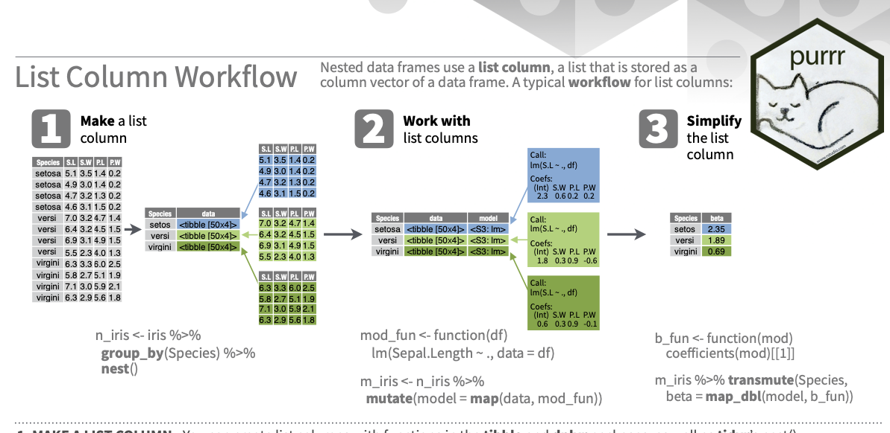

### Bibliotecas
```{r}

library(tidyverse)

```

### Funções

* Tudo no R são funções 
```{r}
  1 + 1 
  mean(1:5)
  `+`(1, 1)
  `mean` <- function(x) x+1
     
  mean(1:5)
   
  rm(mean)
```

```{r}

cat("Alô Mundo!")

 f <- function() {
    cat("Alô Mundo!") 
   }
 f()

 f <- function(x, y) { 
   cat(x, y) 
   }

  f(x = "Oieeeee", y = "Tudo bem ?")
 f("Oieeeee", "Tudo bem ?")
 
 f(y = "Tudo bem ?", x ="Oieeeee")
 
```


* Automação
* Empacotar atividades repetitivas complexas

Wickham & Grolmund (2017, cap 19 )

```{r}
  
  df <- tibble::tibble(
    a = rnorm(100),
    b = rnorm(100),
    c = rnorm(100),
    d = rnorm(100)
  )

  df %>% ggplot(aes(x=a)) + 
    geom_histogram(fill = "white", color = "black")

  df$a <- (df$a - min(df$a, na.rm = TRUE)) / 
  (max(df$a, na.rm = TRUE) - min(df$a, na.rm = TRUE))
  
  df$b <- (df$b - min(df$b, na.rm = TRUE)) / 
    (max(df$b, na.rm = TRUE) - min(df$a, na.rm = TRUE))
  
  df$c <- (df$c - min(df$c, na.rm = TRUE)) / 
    (max(df$c, na.rm = TRUE) - min(df$c, na.rm = TRUE))
  
  df$d <- (df$d - min(df$d, na.rm = TRUE)) / 
    (max(df$d, na.rm = TRUE) - min(df$d, na.rm = TRUE))
  
  x <- df$a
  (x - min(x, na.rm = TRUE)) / (max(x, na.rm = TRUE) - min(x, na.rm = TRUE))
  
  rng <- range(x, na.rm = TRUE)
  
  (x - rng[1]) / (rng[2] - rng[1])
  
 rng <- range(df$a, na.rm = TRUE)
 rng[2]
 
  x = df$a
  
  (x - -2.2) / 5.11
  
  
  rescale01 <- function(x) {
    rng <- range(x, na.rm = TRUE)
    (x - rng[1]) / (rng[2] - rng[1])
  }
 
  df <- tibble::tibble(
    a = rnorm(10),
    b = rnorm(10),
    c = rnorm(10),
    d = rnorm(10),
    e = 1
  )
  
   df <- tibble::tibble(
    a = rnorm(10),
    b = rnorm(10),
    c = rnorm(10),
    d = rnorm(10)
  )

  df$a <- rescale01(df$a)
  df$b <- rescale01(df$b)
  df$c <- rescale01(df$c)
  df$d <- rescale01(df$d)
  
  
   rescale01 <- function(x) {
    rng <- range(x, na.rm = TRUE)
    (x - rng[1]) / (rng[2] - rng[1])
  }
  


```

* Mudando a métrica usando dplyrcom a função criada 

```{r}
  
df <- df %>% dplyr::mutate(across(.fns = rescale01))
 
```


Exercício A: faça uma função para transformar uma nota em QI  QI = ((x - M) / DP)*15 + 100.

### Execução condicional


```{r}
 if( condition ) {
        ## do something
 }
 ## Continue with rest of code


  if (condition) {
    # code executed when condition is TRUE
  } else {
    # code executed when condition is FALSE
  }

  if (this) {
    # do that
  } else if (that) {
    # do something else
  } else {
    # 
  }

  tempo <- function(temp) {
 
    if (temp <= 0) {
      "freezing"
    } else if (temp <= 10) {
      "cold"
    } else if (temp <= 20) {
      "cool"
    } else if (temp <= 30) {
      "warm"
    } else {
      "hot"
    }
  }
tempo(0)
tempo(40)

tempo(" ")
class(" ")

"" < 0

```

* Switch com controle de erros
```{r}

 f <- function(x, y, op) {
   
   if(!(op %in% c("plus", "minus", "times", "divide"))) {
     stop("Unknown op! fora do switch")
   } 
 
    switch(op,
       plus = x + y,
       minus = x - y,
       times = x * y,
       divide = x / y
      )
    }


f(x = 2, y = 2, op = "times" )


```

### Loops 

```{r}
for(i in 1:10) {  print(i) }

x <- c("a", "b", "c", "d")
x[1]
x[2]

for(i in 1:4) {
    print(x[i])
  }


```

* Fazendo um loop pelas linhas e colunas de uma matriz
```{r}

x <- matrix(data = 1:6, nrow = 2, ncol =  3, byrow = F)

x 


for(i in seq_len(nrow(x))) {
  
  for(j in seq_len(ncol(x))) {
  
    print( x[i, j] )
  
    } 
}


```

* Funçòes para crianção de índices para o ;oop

```{r}

seq_len(20)
seq_along(3:9)


f <- function(num) {
  for(i in seq_len(num)) {
    print(paste0(i, ". ", "Alô, mundo!"))
   } 
}

f(3)
f(20)
seq_len(20)

load("../dados/enem.Rdata")

for (nm in names(enem[ , 1:20])){
  
 print(head(enem[ , nm], n = 4))
  
}

```

```{r}

```

* Partes de um loop
```{r}

df

median(df$a)
median(df$b)
median(df$c)
median(df$d)

df <-  as.data.frame(df)
df <-  as.tibble(df)


output <- vector("double", ncol(df))  # 1. output

for (i in seq_along(df)) {            # 2. sequence
  
  output[[i]] <- median(df[[i]])      # 3. body

  }

output


means <- c(1, 50, 20)

out <- vector("list", length(means))

for (i in 1:length(means)) {
  out[[i]] <- rnorm(10, means[[i]])
}

out


```

### Apply e lapply 
```{r}
df %>% dplyr::summarise(across(.fns = mean))
```

* Função média das colunas 
```{r}

col_mean <- function(df) {
  output <- vector("double", length(df))
 
   for (i in seq_along(df)) {
    output[i] <- mean(df[[i]])
   }
  output
}


col_mean(df)

```

* Exercício B: crie uma função `row_mean`

### apply
apply

```{r}

apply(df, MARGIN = 2, mean)
apply(df, MARGIN = 1, mean)
apply(df, MARGIN = 1, sum)

df <- apply(
  df, 
  MARGIN = 2, 
  function(x){ x -  mean(x) } 
  )

```


* Quantos itens em branco no questionário socio econômico do ENEM

```{r}

v <- names(enem)[45:94]
enem %>% select(v) %>% view

enem %>% select(v[1:10]) %>% sjmisc::frq()

enem$itens_respond <- apply(
  enem[ , v], 
  MARGIN = 1, 
  function(x){ sum(!is.na(x)) } 
  )

sjmisc::frq(enem$itens_respond)


```

* Exercício C: use o apply para calcular um escore total no ENEM considerando as notas das quatro provas e a redação 

* lapply
```{r}

x <- 1:4
lapply(x, runif)
lapply(x, rnorm)

lapply(list(1:4, 1, 1:3), print)


hist(runif(10000))

x <- list(a = 1:10, b = rnorm(10), c = rnorm(10, 1), d = rnorm(10, 5))

x <- as.data.frame(x)

x <- as.tibble(x)

mean(x[ , 1])

lapply(x, mean)

lapply(x, print)

x <- 1:10

lst <- lapply(x, print)

 getAnywhere(lapply)
 body(lapply)
 
 View(lapply)
 View(mean)

```

### Purrr

  

```{r}
library(purrr)

map(df, mean)

df2 <- map(df, mean)
df2 <- map_dbl(df, mean)
df2 <- map_chr(df, mean)

str(map_dbl(df, mean))

v <- letters

v2 <- map(v, print)
map(v, print)
walk(v, print)


```

* map2 e pmap para simulações 

```{r}


mean <- list(5, 10, 15)
sd <- list(1, 5, 10)


map2(mean, sd, rnorm(), n = 10)
map2( list(5, 10, 15), list(1, 5, 10), rnorm())
rnorm(c(5, 10, 15), c(1, 5, 10))

map2 <- function(x, y, f, ...) {
  
  out <- vector("list", length(x))
  
  for (i in seq_along(x)) {
    out[[i]] <- f(x[[i]], y[[i]], ...)
  }
  out
}
```

  

```{r}

n <- list(1, 3, 5)
mean <- list(5, 10, -3)
sd <- list(1, 5, 10)

args1 <- list(mean = c(5, 10, -3) , n = c(1, 3, 5),  sd = c(1, 5, 10))

args1[1]

pmap(args1, rnorm)

args1 %>% pmap(rnorm)
 

args2 <- list(mean = mean, sd = sd, n = n)

args2 %>% 
  pmap(rnorm) %>% 
  str()
library(tibble)

params <- tribble(
  ~mean, ~sd, ~n,
    5,     1,  1,
   10,     5,  3,
   -3,    10,  5
)
params %>% 
  pmap(rnorm)


```

  
* Invoke map

```{r}
f <- c("runif", "rnorm", "rpois")

param <- list(
  list(min = -1, max = 1), 
  list(sd = 5), 
  list(lambda = 10)
)

invoke_map(f, param, n = 5) 


sim <- tribble(
  ~f,      ~params,
  "runif", list(min = -1, max = 1),
  "rnorm", list(sd = 5),
  "rpois", list(lambda = 10)
)

library(tidyverse)

sim <- sim %>% 
  mutate(
    dados = invoke_map(f, params, n = 10)
    )

# Desafio
sim <- sim %>% mutate( media = map(dados, ~mean))


```
  

### List columns

* Criar um índice socio-econômico no ENEM
* Fazer uma regressão por estado: e quais estados o índice está mais relacionado ?

1. Examinar as variáveis e seus tipos

```{r}
  library(broom)
  library(sjmisc)
  library(sjlabelled)
 


  load("../dados/enem.Rdata")
 
  get_label(enem) %>% as.data.frame %>% view
  
  frq(enem$Q002)
  
  class(enem$Q002)
  
  typeof(enem$Q002)
  
  enem$Q002
  
  levels(enem$Q002)
  
  enem %>% select(Q007:Q025) %>% frq
  enem %>% select(Q007:Q025) %>% map(class)
  enem %>% select(Q007:Q025) %>% map(levels)
  
  enem %>% select(Q007:Q025) %>% map_df(as.numeric)
  
  
  # desafio ! explicar ~
  
  enem %>% select(Q007:Q025) %>% map( function(x){sum( is.na(x) )} )
  
  y =  is.na(x)
  sum(y)
  
  enem %>% select(Q007:Q025) %>% map( ~sum(is.na(.)) )
  
  
  is.na(enem$Q007) %>% table
  
  
  enem %>% frq(SG_UF_RESIDENCIA)
  
  frq(enem$Q001)
```

2. SES = posses + escolaridade da mae e pai 

* Pré-processamento para criar escolaridade
```{r}

enem %>% select(Q001:Q002) %>% map(levels)

library(scales)


escolarid <- enem %>% 
  select(Q001:Q002) %>%
  map_df(as.numeric) %>%
  map_df(~ifelse(. == 8, NA_integer_, .)) %>%
  map_df(~scales::rescale(.x)) %>%
  mutate(escolarid = across(Q001:Q002, mean, na.rm=TRUE)) 

escolarid <- enem %>% 
  select(Q001:Q002) %>%
  map_df(as.numeric) %>%
  map_df(~ifelse(. == 8, NA_integer_, .)) %>%
  map_df(~scales::rescale(.x)) %>%
  rowwise %>%
  mutate(escolarid = mean(c_across(Q001:Q002), na.rm=TRUE)) %>%
  ungroup()

# function(x) { is.na(x)}

escolarid <- enem %>% 
  select(Q001:Q002) %>%
  map_df(as.numeric) %>%
  map_df(~ifelse(. == 8, NA_integer_, .)) %>%
  map_df(~scales::rescale(.x)) 

escolarid$escolarid <- apply(escolarid, MARGIN = 1, mean, na.rm = TRUE)

```

* Pré-processamento para criar variável posses

```{r}
   

  enem %>% select(Q007:Q025) %>% get_label() %>% as.data.frame %>% view
  

  enem %>% select(Q007:Q025) %>% map(levels)
 
  library(psych)
  library(corrr)
   
  enem %>% 
    select(Q007:Q025) %>% 
    map_df(as.numeric) %>%
    correlate() %>%
    corrr::network_plot()
  
  enem %>% 
    select(Q007:Q025) %>% 
    map_df(as.numeric) %>%
    alpha() 
     
 posses <-  enem %>% 
  select(Q007:Q025) %>% 
  map_df(as.numeric) %>%
  map_df(~scales::rescale(.x)) %>%
  rowwise %>%
  mutate(posses = mean(c_across(Q007:Q025), na.rm=TRUE)) %>%
  ungroup()
 
 

```

* Adiciona ao banco e cria ENEM geral
```{r}

 enem <- bind_cols(
   enem, 
   escolarid = escolarid$escolarid, 
   posses = posses$posses
   )

 names(enem)
 
 cor(enem[, 98:99], use="pairwise")
 
 ggplot(enem, aes(x=escolarid, y=posses, color = TP_SEXO)) + geom_point() + geom_smooth()
 
 
      
 enem %>% 
  select(Q007:Q025) %>% 
  map_df(as.numeric) %>%
  map_df(~scales::rescale(.x)) %>%
  rowwise %>%
  transmute(posses = mean(c_across(Q007:Q025), na.rm=TRUE)) %>%
  pull(posses)
 
 names(enem)
 
 
 enem <- enem %>% 
   rowwise() %>%
   mutate(
    ses = mean(escolarid, posses, na.rm=TRUE),
    enem_tot =  mean(c_across(NU_NOTA_CN:NU_NOTA_MT), na.rm=TRUE),
    enem_sd =  sd(c_across(NU_NOTA_CN:NU_NOTA_MT), na.rm=TRUE)
        ) %>%
   ungroup()
 
 
 # Nao funciona ?
 enem %>% 
  select(Q007:Q025) %>%
   map_df(as.numeric) %>%
   mutate_all(escore = mean, na.rm = TRUE)
 
 
 enem %>% select(NU_NOTA_CN:NU_NOTA_MT, NU_NOTA_REDACAO,   escolarid:enem_tot) %>%
    corr.test()
 


```

* Regressão linear

```{r}

  enem %>% 
    ggplot(aes(y = enem_tot, x = ses, color = posses) ) +
     geom_point(alpha = 1/3) +
     geom_smooth(method = "lm") 


  enem %>% 
   filter(SG_UF_RESIDENCIA == "GO") %>%
    ggplot(aes(y = enem_tot, x = ses, color = posses) ) +
     geom_point(alpha = 1/3) +
     geom_smooth() 

   frq(enem$TP_COR_RACA)
  
  fit <-  enem %>% 
    lm( enem_tot ~ ses+TP_SEXO+TP_COR_RACA, data = .)
  
  forcats::fct_re
  
  library(sjPlot)
  tab_model(fit, show.std = TRUE, show.reflvl = TRUE)
  
  library(broom)
  library(lm.beta)
  
  glance(fit)
  tidy(fit)
  
  fit %>% lm.beta %>% tidy
 
  

  fit <-  enem %>% 
   filter(SG_UF_RESIDENCIA == "GO") %>%
    lm( enem_tot ~ ses+TP_SEXO+TP_COR_RACA, data = .)

  
  class(enem$SG_UF_RESIDENCIA)
  
  typeof(enem$SG_UF_RESIDENCIA)

  enem %>% frq(SG_UF_RESIDENCIA)
  enem %>% select(SG_UF_RESIDENCIA) %>% map(as.factor) %>% map(levels)
 

```

  


```{r}

 mutate(SG_UF_RESIDENCIA)

enem_uf <- enem %>% 
  select(SG_UF_RESIDENCIA, enem_tot, ses, TP_SEXO, TP_COR_RACA) %>%
  group_by(SG_UF_RESIDENCIA) %>%
  nest()

str(enem_uf$data)
glimpse(enem_uf$data)

enem_uf$SG_UF_RESIDENCIA[[1]]
enem_uf$data[[1]]


enem_uf$SG_UF_RESIDENCIA[[2]]
enem_uf$data[[2]]


f <- function(df) {
  lm(enem_tot~ses+TP_SEXO+TP_COR_RACA, data = df)
}


enem_uf <- enem_uf %>%
  mutate(fit = map(data, f))

enem_uf$fit[[2]]

length(enem_uf$fit)

enem_uf$SG_UF_RESIDENCIA

tab_model(enem_uf$fit[[2]], show.std = TRUE)

tidy(enem_uf$fit[[1]])

broom::glance(enem_uf$fit[[2]])


enem_uf_resu <- enem_uf %>%
  mutate(resu = map(fit, broom::glance)) %>%
  select(resu) %>%
  unnest(resu)

enem_uf_resu2 <- enem_uf %>%
  mutate(resu = map(fit, ~broom::tidy(lm.beta(.x)))) %>%
  select(resu) %>%
  unnest(resu)


enem_uf %>% filter(SG_UF_RESIDENCIA == "SE") %>%
  pull(fit) %>%
   tab_model(show.std = TRUE)
 
 


```

### Exercício

* Faça um gráfico de barra com os r.squared por estado ordenando o estado com maior r-squared ao menor  

* Diferenças de genero nos estados

